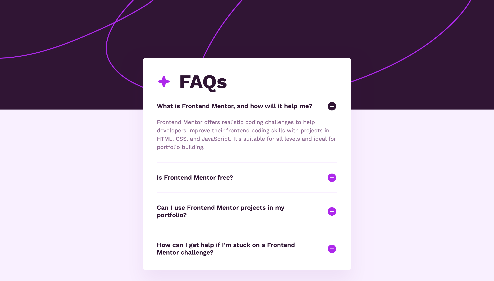
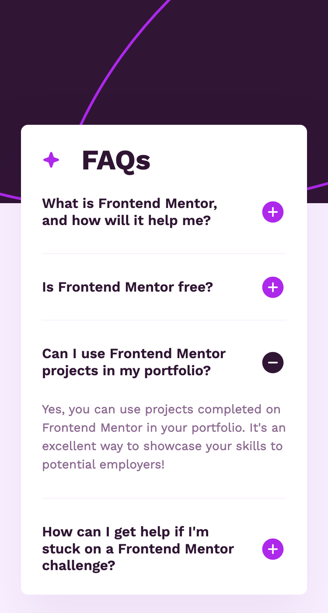

# Frontend Mentor - FAQ accordion solution

This is a solution to the [FAQ accordion challenge on Frontend Mentor](https://www.frontendmentor.io/challenges/faq-accordion-wyfFdeBwBz). Frontend Mentor challenges help you improve your coding skills by building realistic projects.

## Table of contents

- [Overview](#overview)
  - [The challenge](#the-challenge)
  - [Screenshot](#screenshot)
  - [Links](#links)
- [My process](#my-process)
  - [Built with](#built-with)
  - [What I learned](#what-i-learned)
  - [Continued development](#continued-development)
  - [Useful resources](#useful-resources)
- [Author](#author)

## Overview

### The challenge

Users should be able to:

- Hide/Show the answer to a question when the question is clicked
- Navigate the questions and hide/show answers using keyboard navigation alone
- View the optimal layout for the interface depending on their device's screen size
- See hover and focus states for all interactive elements on the page

### Screenshot




### Links

- Solution URL: [https://github.com/srijanss/faq-accordion](https://github.com/srijanss/faq-accordion)
- Live Site URL: [https://srijanss.github.io/faq-accordion/](https://srijanss.github.io/faq-accordion/)

## My process

### Built with

- Semantic HTML5 markup
- CSS custom properties
- Flexbox
- Mobile-first workflow

### What I learned

I learned about the details element which is semantic html tag for creating accordion.

```html
<details name="faqs">
  <summary>What is Frontend Mentor, and how will it help me?</summary>
  <p>
    Frontend Mentor offers realistic coding challenges to help developers
    improve their frontend coding skills with projects in HTML, CSS, and
    JavaScript. It's suitable for all levels and ideal for portfolio building.
  </p>
</details>
```

I also learned how to hide the default triangle icon of details element on webkit based browsers(Safari)

```css
details summary::-webkit-details-marker {
  display: none;
}
```

### Continued development

I had some issues with accordion section kept open even if the other sections are opened. In Chrome and Safari using the same name on details element helped solve this issue. But in Firefox it doesn't work. It can only be done using JS for Firefox. So, I will add the JS based status change operation for the accordion as continued development.

### Useful resources

- [The Details disclosure element](https://developer.mozilla.org/en-US/docs/Web/HTML/Element/details)

## Author

- Website - [Srijan Manandhar](https://github.com/srijanss)
- Frontend Mentor - [@srijanss](https://www.frontendmentor.io/profile/srijanss)
